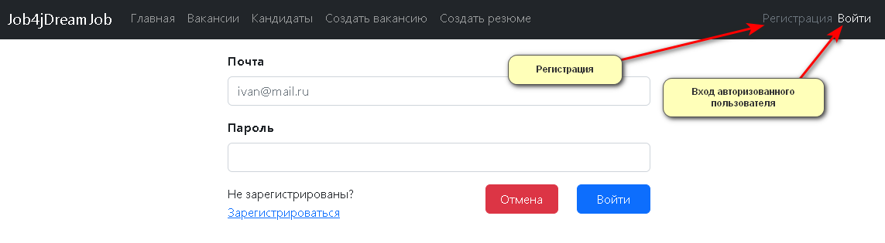
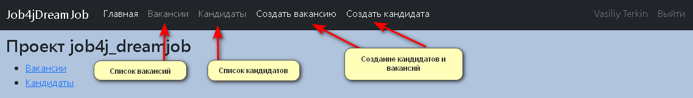
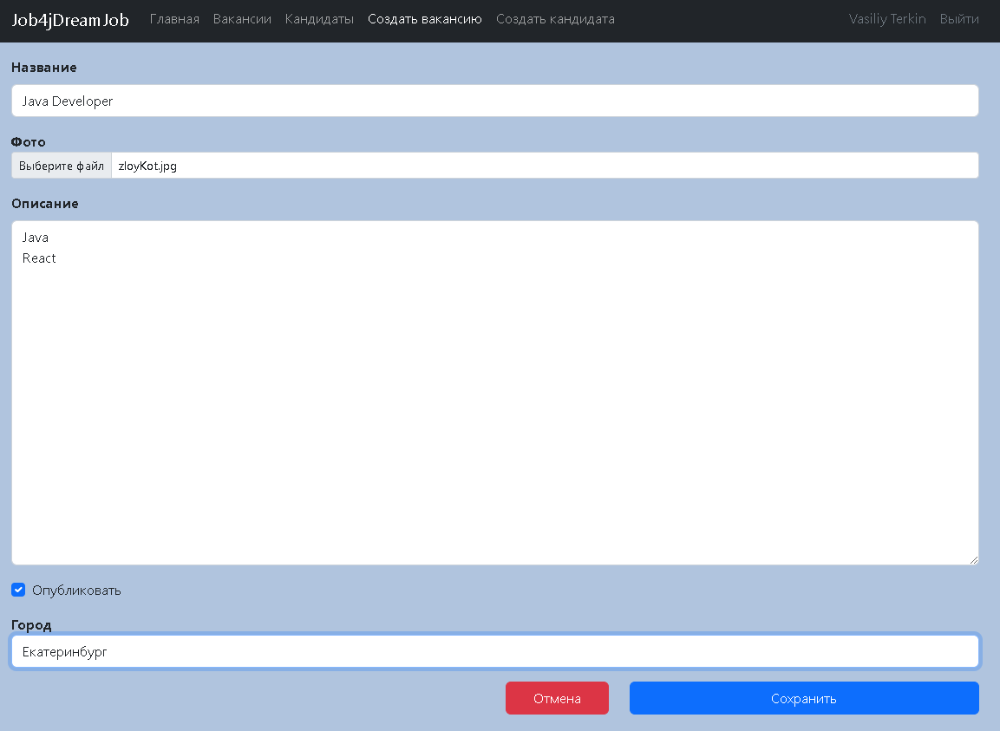
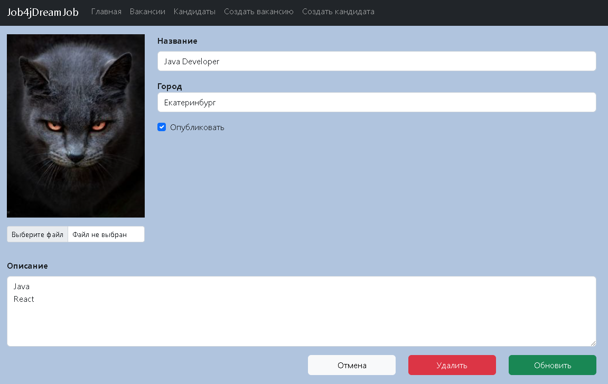
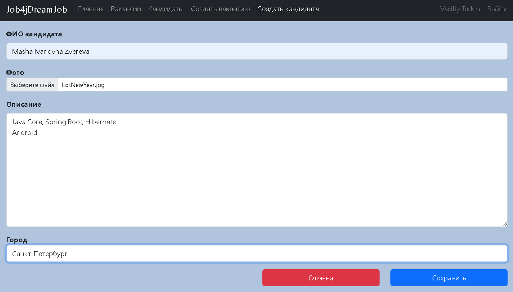
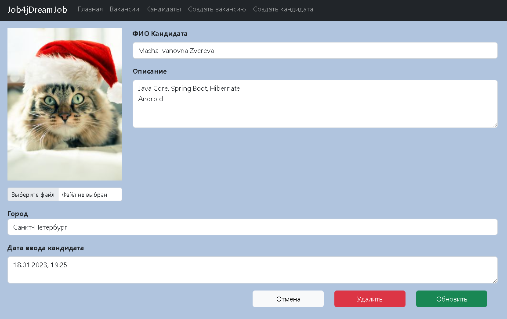

Приложение "Работа мечты".

В системе будут две модели: вакансии и кандидаты. 
Кандидаты будут публиковать резюме. 
Кадровики будут публиковать вакансии о работе.
Кандидаты могут откликнуться на вакансию. 
Кадровик может пригласить на вакансию кандидата.

1. Вход в приложение - реализован фильтр. Разделение прав - только зарегистрированный пользователь может работать
   с заявками.

Реализована проверка по емайл - уникальное поле для каждого пользователя.
2. Основной экран
- вакансии
- кандидаты
- создание вакансии
- создание кандидата
В списках вакансий и кандидатов возможны операции удаления кандидатов(вакансий), а также их редактирование.

3. Экран создания вакансии

4. Экран редактирования вакансии

5. Экран ввода кандидата

6. Экран редактирование кандидата

7. Хранение данных - Postgres SQL.
